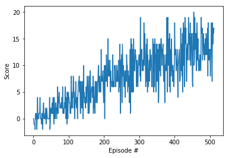

[//]: # (Image References)

[image1]: https://user-images.githubusercontent.com/10624937/42135619-d90f2f28-7d12-11e8-8823-82b970a54d7e.gif "Trained Agent"

# Project 1: Navigation

## Project details

This project trains an agent to navigate (and collect bananas!) in a large, square world.  

![Trained Agent][image1]

### Reward

This project has two types of rewards.
- **`+1`** for collecting a yellow banana
- **`-1`** for collecting a blue banana

Thus, the goal of your agent is to collect as many yellow bananas as possible while avoiding blue bananas. 

### States

The state space has 37 dimensions and contains the agent's velocity, along with ray-based perception of objects around agent's forward direction. 

### Actions

Four discrete actions are available, corresponding to:
- **`0`** - move forward.
- **`1`** - move backward.
- **`2`** - turn left.
- **`3`** - turn right.

### Success condition
The task is episodic, and is considered if agent get an average score of +13 over 100 consecutive episodes.

## Getting Started

### Install dependencies
`cd ..`

`pip install -r requirements.txt`

### Setting environment

1. Download the environment from one of the links below.  You need only select the environment that matches your operating system:
    - Linux: [click here](https://s3-us-west-1.amazonaws.com/udacity-drlnd/P1/Banana/Banana_Linux.zip)
    - Mac OSX: [click here](https://s3-us-west-1.amazonaws.com/udacity-drlnd/P1/Banana/Banana.app.zip)
    - Windows (32-bit): [click here](https://s3-us-west-1.amazonaws.com/udacity-drlnd/P1/Banana/Banana_Windows_x86.zip)
    - Windows (64-bit): [click here](https://s3-us-west-1.amazonaws.com/udacity-drlnd/P1/Banana/Banana_Windows_x86_64.zip)
    
    (_For Windows users_) Check out [this link](https://support.microsoft.com/en-us/help/827218/how-to-determine-whether-a-computer-is-running-a-32-bit-version-or-64) if you need help with determining if your computer is running a 32-bit version or 64-bit version of the Windows operating system.

    (_For AWS_) If you'd like to train the agent on AWS (and have not [enabled a virtual screen](https://github.com/Unity-Technologies/ml-agents/blob/master/docs/Training-on-Amazon-Web-Service.md)), then please use [this link](https://s3-us-west-1.amazonaws.com/udacity-drlnd/P1/Banana/Banana_Linux_NoVis.zip) to obtain the environment.

2. Place the file in the DRLND GitHub repository, in the current folder, and unzip (or decompress) the file. 

## Instructions

Follow the instructions for each purpose.

### Training an agent

`python train_agent [args]`

The followings are args to be used for training.

* --n_episodes [int] : maximum number of training episodes, default=2000
* --eps_start [float] : starting value of epsilon,, default=1.0
* --eps_end [float] : minimum value of epsilon, default=0.01
* --eps_decay [float] : rate to decay epsilon, default=0.995
* --success_score [float] : score condition to success, default=13
* --seed [int] : random seed, default=0
* --model_path [str] : model checkpoint path, default='checkpoint.pth'

### Infer an agent

`python infer_agent [args]`

The followings are args to be used for inference.

* --n_episodes [int] : maximum number of training episodes, default=2000
* --seed [int] : random seed, default=0
* --model_path [str] : model checkpoint path, default='checkpoint.pth'

### Report result

Follow the instructions in `Report.ipynb` to check result in the report. 

## Result summary

The agent success to solve the task in 412 episodes. The below figure is the average scores plot along episodes.

## Future work

For future work, double DQN, a dueling DQN, and/or prioritized experience replay will be implemented and compared performance with current agent.
 
## References

*[DQN on Udacity Deep RL ND](https://github.com/udacity/deep-reinforcement-learning/dqn)

*[Navigation example on Udacity Deep RL ND](https://github.com/udacity/deep-reinforcement-learning/tree/master/p1_navigation)

*[Welcome to Deep Reinforcement Learning Part 1 : DQN](https://towardsdatascience.com/welcome-to-deep-reinforcement-learning-part-1-dqn-c3cab4d41b6b)
